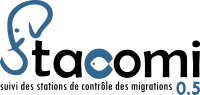

---
title: StacomiR
author: Marion Legrand, Cédric Briand
output: github_document
toc: true
---  

[](https://cran.r-project.org/package=stacomiR)


# stacomiR 


Introduction
--------------------------

Migratory fishes population are vulnerable as they are often more prone to human
impact when migrating in rivers and to the ocean. They are often counted at
stations when they perform the migrations at some of their lifestages, and these
counts provide valuable indices to the population size and trend. The objective
of the stacomi project is to provide a common database for people monitoring
fish migration, so that data from watershed are shared, and stocks exchanging
between different basins are better managed. The stacomi database, is an
open-source database, it managed with a JAVA interface, and results from that
database are treated directly with the stacomiR project.


Installation
-------------------------

The package is available from CRAN, a development version is available from
R-Forge.


```r
install.packages("stacomiR", repos="http://R-Forge.R-project.org")
```

Usage
-------------------------

Launch the graphical interface


```r
stacomi()
```

The program can be launched to use from the command line


```r
stacomi(gr_interface = FALSE, login_window = TRUE, database_expected = TRUE)
```


Data structure
-------------------    
The open source postgresql database was built on the following concepts.
*Contact the authors to get a copy of the database*.

### Infrastructure
A migration report is always built on a section of a river. However, dam and
fishways can have a complex structure, with the river divided into several
branches, arriving at different dams. A fishway or river section can also be
monitored by different counting devices.

#### Station
A station of fish migration monitoring is considered to be
a section of a watercourse where fish upstream or
downstream migration is monitored.
The station covers the whole section of a single river, but can extend to
several natural or artificial channels. A station consists physically of as many
weirs as hydrographic sections monitored (river, channels, etc.). According to
the local settings, it corresponds to one river location with a counting device,
or to one or several dams.

#### Weir
The concept of weir used in the context of fish migration monitoring database
refers to a system blocking or guiding the migratory flow like : 
* dam, 
* electric guide barrier, 
* netting dam, 
* etc.

#### Crossing device   
A crossing device (DF) is a passageway that allows and concentrates the
migratory flow between upstream and downstream sections of a weir. They can be
of various type
* fishway, 
* spillway, 
* fish elevator, 
* etc.

It is possible to have more than one crossing device on a same weir.

#### Counting device
A couting device (DC) is a set of equipment installed on a crossing devise 
to monitor fish migration.
It can be :
* a video counting device, 
* a trap pass, 
* an acoustic counting device, 
* etc.

#### Environmental monitoring station


### Migration
Whatever infrastructure is all fishes passing through a counting device are
monitored.

#### Monitoring operation
An operation represents a monitoring varying duration of a counting device. It
therefore includes a start and end date for a specific counting device.

#### Fishes
Fishes passing a counting device during a monitoring operation are
species and stage determined and counted.

#### Other features

 Package structure
--------------------
The package relies on S4 classes. *Referential classes* are used to access data
from the database (taxa, stages, counting devices...).
*Report classes* are built from referential classes and have different methods
to access the database *connect methods*, generate calculations *calcule
method*, or plot results. 
For instance, the migration report class comprises slots for :
***
* DC The counting device (camera, trap, acoustic device...)
* taxa The species list from the database and the taxa selected
* stage The stages list from the database and the stage selected
* starting date The date of beginning
* ending date The last date of the report
***

| Class         | Report type    | description| 
| ------------- |:----------| ---------------------------------: | 
|report_mig    | Annual migration | Annual migration report  | 
| report_mig_mult| Annual migration| Annual migration (several DC, taxa...) |


Working examples
-------------------------

###        Command line

Examples are provided with each of the class, you can access them simply by
typing `? report_mig_mult`
The program is intented to be used in conjuntion with the database, to test it
without access, use the arguments `login_windows=FALSE` and
`database_expected=FALSE`

 
 ```r
 ## launches the application in the command line without connection to the database
 stacomi(gr_interface=FALSE,login_window=FALSE,database_expected=FALSE) 
 ```
The
following code is only run when there is a connection to the database. The
program will create an object of the class report_mig_mult, and run it for several DC, here 5 is a
vertical slot fishway, and 6 and 12 are two glass eel trapping ladder located
at the Arzal dam in the
Vilaine river (France).
We are evaluating the migration
of all stages of eel (glass eel CIV, yellow eel AGJ and silver eel AGJ).
Glass
eel and yellow eel migrate to the watershed while silver eel
are migrating back
to the ocean.
Data are loaded from the database with the `charge` method and the `calcule`
method
will
interpolate
daily
migration from monitoring operations which do not necessarily span a day, and convert the glass eel
weight in numbers.
 
 ```r
   stacomi(gr_interface=FALSE,
 	  login_window=FALSE,
 	  database_expected=TRUE)	
  r_mig_mult=new("report_mig_mult")
  r_mig_mult=choice_c(r_mig_mult,
 	  dc=c(5,6,12),
 	  taxa=c("Anguilla anguilla"),
 	  stage=c("AGG","AGJ","CIV"),
      datedebut="2011-01-01",
      datefin="2011-12-31")
  r_mig_mult<-charge(r_mig_mult)
  # launching charge will also load classes associated with the report
  # e.g. report_ope, report_df, report_dc
  r_mig_mult<-connect(r_mig_mult)
  # calculations 
  r_mig_mult<-calcule(r_mig_mult,silent=TRUE)
 ```
The previous line generates data not only about the report_mig_mult class,
but also describing how the fishway (DF) and counting devices (DC) have been operated.
Sometimes there is no migration but only because the camera was jammed. There are also information
about the operations (e.g. periods at wich a trap content has been evaluated). Here we load what
would have been generated if we had run the previous lines.

 
 ```r
 data("r_mig_mult")
 data("r_mig_mult_ope")
 assign("report_ope",r_mig_mult_ope,envir=envir_stacomi)
 data("r_mig_mult_df")
 assign("report_df",r_mig_mult_df,envir=envir_stacomi)
 data("r_mig_mult_dc")
 assign("report_dc",r_mig_mult_dc,envir=envir_stacomi)
 r_mig_mult<-calcule(r_mig_mult,silent=TRUE)
 #> Error in (function (classes, fdef, mtable) : unable to find an inherited method for function 'calcule' for signature '"report_mig_mult"'
 ```

Individual plot for all DC, taxa and stage where data present
Silent=TRUE to turn off messages


```
#> Error in as.double(y): cannot coerce type 'S4' to vector of type 'double'
```
Ci dessous ne marche pas générer à la main puis expliquer et lien

```
#> Error in as.double(y): cannot coerce type 'S4' to vector of type 'double'
```


### R-GTK2 graphical interface


License
-------

The STACOMI project is released under GPL-2.
