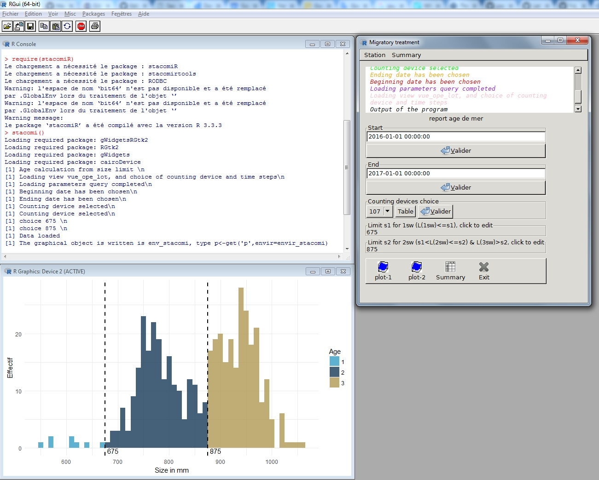
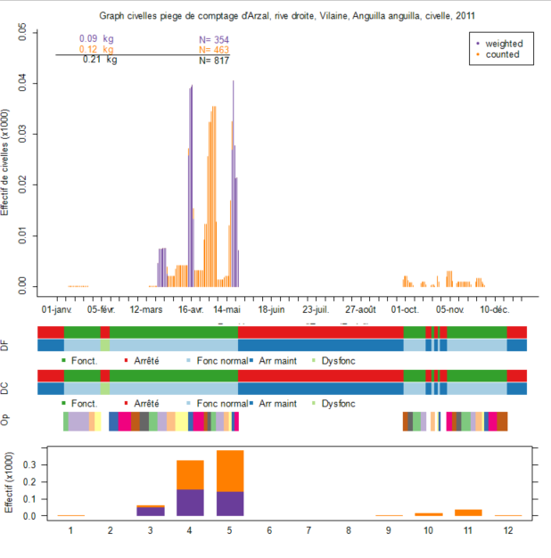

# Summary

Migratory fishes population are vulnerable as they are often more prone to human impact when migrating in rivers and to the ocean [@mcdowall_1992].
They are often counted at stations when they perform the migrations at some of their lifestages, and these counts provide valuable indices to
the population size and trend. 
The objective of the stacomi project is to provide a common database for people monitoring fish migration, so that data from watershed are shared, and stocks exchanging between different basins are better managed. The stacomi database, is an open-source database, it managed with a JAVA interface, and results from
that database are treated directly with the stacomiR package[@R2017]. The program is intended to be used by a "non experienced" R user, but all the R code automatically generated by the programm is shown to the user. Thus, it is possible to copy/paste the code and modify it (for example to change the preprogrammed colors or make more complicated changes). 
The package is available from CRAN, a development version is available
from R-Forge.

```{R}
# Installation
install.packages("stacomiR") # get the package from CRAN
install.packages("stacomiR", repos="http://R-Forge.R-project.org") # get the development version
library(stacomiR)

# Launch the graphical interface
## For user having the stacomi database
stacomi()
## For user without connection to the database
stacomi(gr_interface=FALSE,login_window=FALSE,database_expected=FALSE) 
```

Launching `stacomi()` will create the interface. The interface looks
like :



```{R}
# Plot for example, the glass eel migration in weight and number (top), the periods and type of operation for DF and DC, 
# and the operation (trapping periods) (middle), a summary of migration per month (bottom). 
## For user without the connection to the database
data("r_mig")
data("r_mig_ope")
assign("report_ope",r_mig_ope,envir=envir_stacomi)
data("r_mig_df")
assign("report_df",r_mig_df,envir=envir_stacomi)
data("r_mig_dc")
assign("report_dc",r_mig_dc,envir=envir_stacomi)
plot(r_mig,plot.type="standard",silent=TRUE)

```


# References