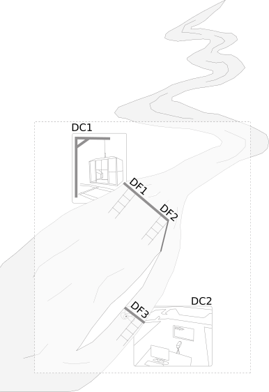

```{r setup, include = FALSE}
knitr::opts_chunk$set(
  collapse = TRUE,
  comment = "#>",
  fig.path = "../man/figures/README-"
)
require(knitr)
opts_knit$set(message=FALSE, warnings=FALSE,error=FALSE,include=FALSE) 
```

# stacomiR 

```{r echo=FALSE}
library(stacomiR)

```
Introduction
--------------------------

Migratory fishes population are vulnerable as they are often more prone to human
impact when migrating in rivers and to the ocean ([McDowall,
1992](http://onlinelibrary.wiley.com.inee.bib.cnrs.fr/doi/10.1002/aqc.3270020405/pdf)). They are often counted at
stations when they perform the migrations at some of their lifestages, and these
counts provide valuable indices to the population size and trend. The objective
of the stacomi project is to provide a common database for people monitoring
fish migration, so that data from watershed are shared, and stocks exchanging
between different basins are better managed. The stacomi database, is an
open-source database, it managed with a JAVA interface, and results from that
database are treated directly with the stacomiR project.


Installation
-------------------------

The package is available from CRAN, a development version is available from
R-Forge.

```{r , eval=FALSE}
install.packages("stacomiR") # get the package from CRAN
install.packages("stacomiR", repos="http://R-Forge.R-project.org") # get the development version
```

Usage
-------------------------

Launch the graphical interface

```{r , eval=FALSE}
stacomi()
```

The program can be launched to use from the command line

```{r , eval=FALSE}
stacomi(gr_interface = FALSE, login_window = TRUE, database_expected = TRUE)
```


Data structure
-------------------    
The open source postgresql database comprises a common schema with dictionaries,
and different schema for different users. Each user can save its own schema and
send it to others. The
database comprises tables related to infrastructure, operations and fish
samples. 
*Contact the authors to get a copy of the database*.

### Infrastructure


#### Station

A migration report is always built on a section of a river, this is called the
station. A station of fish migration monitoring is a section of a watercourse
where fish upstream or downstream migration is monitored. The station covers the
whole section of a single river, but can extend to several natural or artificial
channels. A station consists physically of as many dams as hydrographic sections
monitored (river, channels, etc.). According to the local settings, it
corresponds to one river location with a counting device, or to one or several
dams. For example, in the figure below we can see a station with three crossing device (DF 1 to 3)
and two counting device (DC 1 to 2), the first one beeing a trap counting device (DC1) and the other a video-counting device (DC2).




#### Dams
The concept of dam used in the context of fish migration monitoring database
refers to a system blocking or guiding the migratory flow like : 

* weir, 

* electric guide barrier, 

* netting dam, 

* etc.


#### Crossing device   
A crossing device (DF) is a passageway that allows and concentrates the
migratory flow between upstream and downstream sections of a dam. They can be of
various type :

* fishway, 

* spillway, 

* fish elevator,

* eel trapping ladder, 

* etc.

It is possible to have more than one crossing device on a same dam.

#### Counting device
A counting device (DC) is a set of equipment installed on a crossing device used
to monitor fish migration. It can be :

* a video counting device, 

* a trap, 

* an accoustic counting device, 

* ...


#### Monitoring operation
An operation corresponds to a monitoring of a counting device during a time
span. 

#### Sample
A sample corresponds to a batch of fishes passing during a monitoring operation.
Sample characteristics (length, weight, sex, body measurements) are attached to
the sample. For each sample the species and the stage (which corresponds to a
maturation stage and is related to migratory behaviour) is recorded. 

#### Other features
The database also handles, marking-recapture operations, pathologies, samples
collection (scale, fin sample for genetic...), fate of fishes (released, death,
farmed, etc.), etc... 
Some tables are also used to insert information
about environmental condition such as turbidity, atmospheric pressure,
temperature, flow ...


 Package structure
--------------------
The package relies on S4 classes. *Referential classes* are used to access data
from the database (taxa, stages, counting devices...).
*Report classes* are built from referential classes and have different methods
to access the database *connect methods*, generate calculations *calcule
method*, or plot results. 
For instance, the migration report class comprises slots for :

* DC The counting device (camera, trap, acoustic device...)

* taxa The species list from the database and the taxa selected

* stage The stages list from the database and the stage selected

* starting date The date of beginning

* ending date The last date of the report

Read the help files e.g. `? report_mig` to get documentation on the following
classes.

| Class         | Command    | description| 
| ------------- |:----------|:--------------------------------------- | 
|report_mig    | `new("report_mig")` | Migration report (single) | 
| report_mig_mult| `new("report_mig_mult")`| Migr. (several DC,taxa...) |
| report_annual| `new("report_annual")`| Multi year migration counts     |
| report_dc   | `new("report_dc")`| Counting device operation     |
| report_df   | `new("report_df")`| Fishway operation     |
| report_mig_env  | `new("report_env")`| Migration crossed with env. factors |
| report_mig_char | `new("report_df")`| Migration with fish characteristics |
|report_mig_interannual  | `new("report_mig_interannual")`| Comp. between years|
|report_sample_char | `new("report_sample_char")`| Sample characteristics  |
|report_ge_weight | `new("report_ge_weight")`| Trend in glass eel weight |
|report_silver_eel | `new("report_siver_eel")`| Silver eel migration & stage|
|report_sea_age | `new("report_sea_age")`| Set sea age for Salmon    |
|report_species | `new("report_species")`| Species composition    |


Working examples
-------------------------

### Command line

#### Migration report

Examples are provided with each of the class, you can access them simply by
typing `? report_mig_mult`
The program is intented to be used in conjuntion with the database, to test it
without access, use the arguments `login_windows=FALSE` and
`database_expected=FALSE`


```{r , eval=TRUE, echo=TRUE}
## launches the application in the command line without connection to the database
stacomi(gr_interface=FALSE,login_window=FALSE,database_expected=FALSE) 
```
The
following code is only run when there is a connection to the database. The
program will create an object of the class report_mig_mult, and run it for several DC, here 5 is a
vertical slot fishway, and 6 and 12 are two glass eel trapping ladder located
at the Arzal dam in the
Vilaine river (France).
We are evaluating the migration
of all stages of eel (glass eel CIV, yellow eel AGJ and silver eel AGG).
Glass
eel and yellow eel migrate to the watershed while silver eels
are migrating back
to the ocean.
Data are loaded from the database with the `charge` method and the `calcule`
method
will
interpolate
daily
migration from monitoring operations which do not necessarily span a day, and convert the glass eel
weight in numbers.


